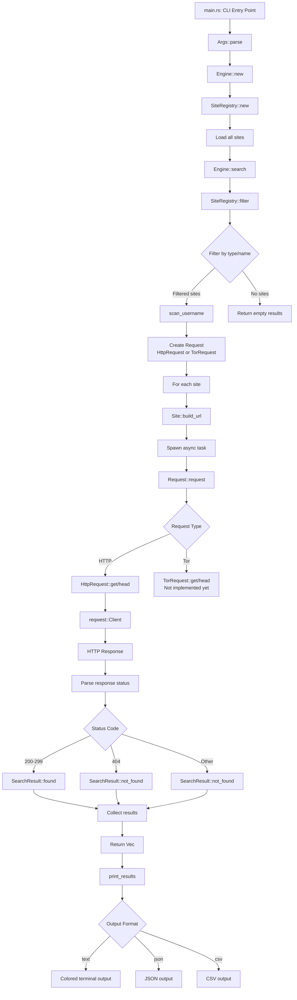
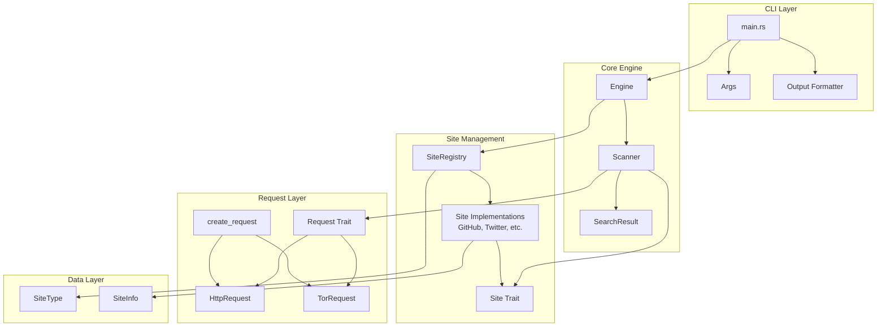
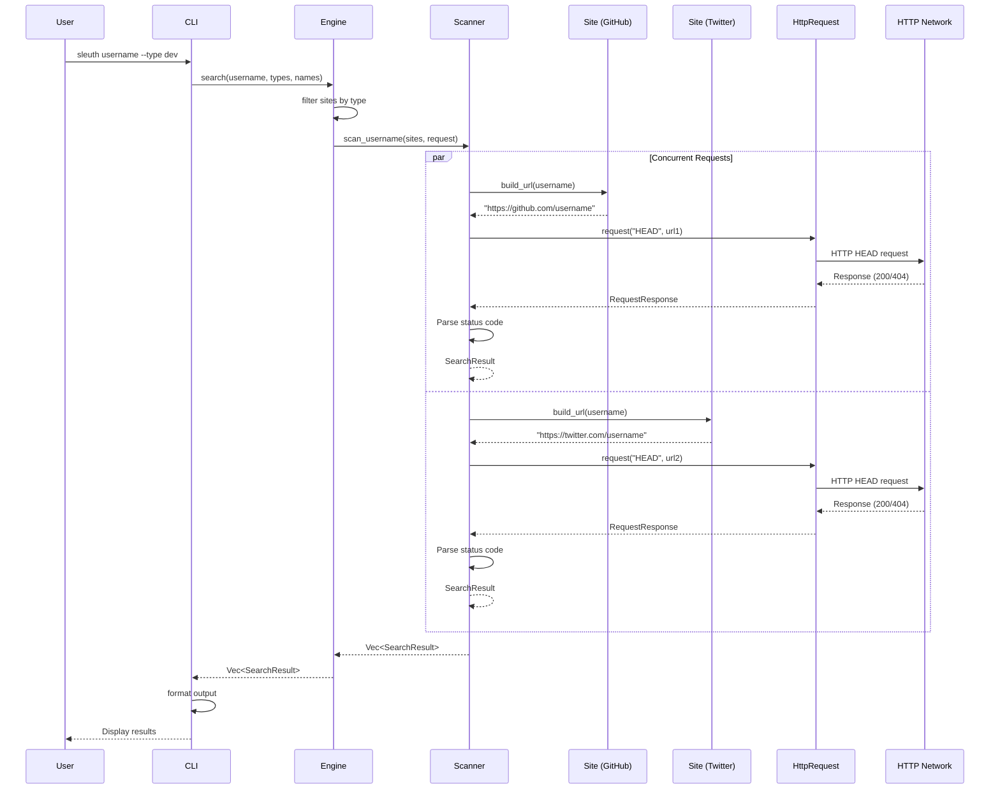

# Sleuth Architecture

## Overview

Sleuth is a Rust implementation of sherlock, an OSINT tool for finding usernames across social networks.

## Directory Structure

```
sleuth/
├── src/
│   ├── main.rs          # CLI entry point
│   ├── lib.rs           # Library root, public API
│   ├── cli/             # Command-line interface
│   ├── core/            # Core engine functionality
│   ├── sites/           # Site-specific implementations
│   ├── request/         # Request abstraction (HTTP, Tor, etc.)
│   ├── config/          # Configuration management
│   ├── data/            # Data structures
│   └── utils/           # Utility functions
├── tests/               # Integration tests
├── examples/            # Example programs
├── benches/             # Benchmarks
└── docs/                # Documentation
```

## Architecture Flow

The following flowchart shows the complete execution flow from user input to results output:



## Component Architecture

This diagram shows the relationships between major components:



## Concurrent Execution Model

This sequence diagram illustrates how concurrent requests are executed using Tokio:



## Core Components

### CLI Module (`src/cli/`)
- Argument parsing with `clap`
- Output formatting (colored terminal, JSON, CSV)
- Progress indicators

### Core Engine (`src/core/`)
- `engine.rs`: Orchestrates searches across sites
- `scanner.rs`: Concurrent scanning logic using Tokio tasks
- `result.rs`: Result types and aggregators

### Sites Module (`src/sites/`)
- Trait-based design for site checkers
- Organized by type in subdirectories (dev, social, professional, gaming, forum, nsfw, other)
- Each site implements the `Site` trait with:
  - `build_url()`: Constructs the URL to check
  - `parse_response()`: Interprets HTTP response (default: 200=exists, 404=not found)
  - `http_method()`: Returns HTTP method to use (default: HEAD)
  - `headers()`: Returns custom headers if needed
- Easy to add new sites by creating files in the appropriate type directory
- All sites are automatically registered via `sites::all_sites()`

### Request Module (`src/request/`)
- Abstraction over HTTP clients via `Request` trait
- `HttpRequest`: Implementation using `reqwest`
- `TorRequest`: Placeholder for future Tor support
- Factory function `create_request()` for creating request implementations
- Allows swapping implementations (HTTP, Tor, etc.) without changing site code

### Configuration (`src/config/`)
- Site registry loaded from data files
- User agent rotation
- Timeout and retry configuration

## Design Patterns

- **Trait-based site checkers**: Each site implements a `Site` trait for consistency
- **Request abstraction**: `Request` trait allows swapping HTTP implementations
- **Async/await**: Concurrent requests using Tokio tasks
- **Error handling**: Custom error types with `thiserror`
- **Separation of concerns**: Sites build URLs and parse responses, Scanner executes requests
- **Modularity**: Clear separation of concerns

## Data Flow

1. **User Input**: CLI parses arguments (username, filters, output format)
2. **Site Filtering**: Engine filters sites by type/name using SiteRegistry
3. **URL Construction**: Each site builds its URL using `Site::build_url()`
4. **Concurrent Requests**: Scanner spawns async tasks for each site
5. **HTTP Execution**: Request trait implementation (HttpRequest) makes actual HTTP calls
6. **Response Parsing**: Scanner parses HTTP responses (currently hardcoded, TODO: use `Site::parse_response()`)
7. **Result Aggregation**: All results collected and returned
8. **Output Formatting**: CLI formats results based on user preference (text/JSON/CSV)

## Testing

- Unit tests are co-located with source files using `#[cfg(test)] mod tests {}`
- Integration tests are in the `tests/` directory
- Benchmarks are in the `benches/` directory
